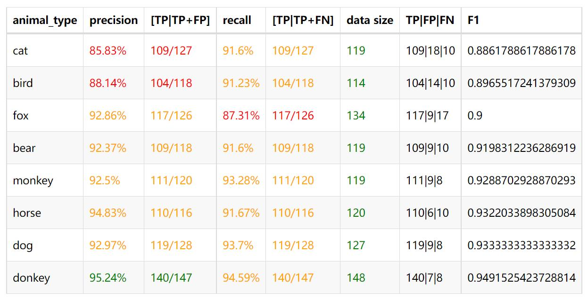
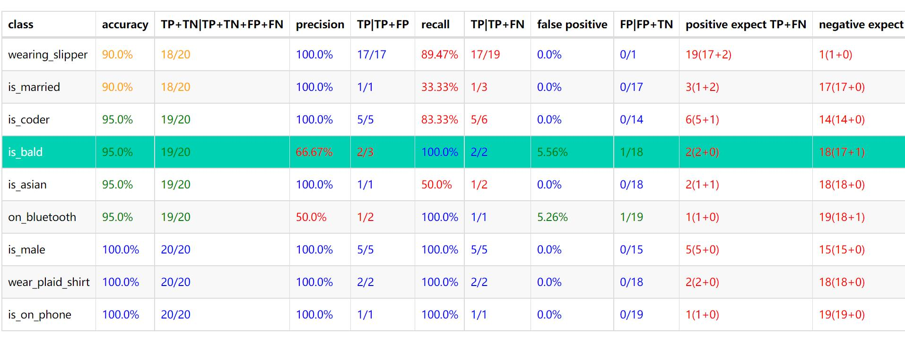
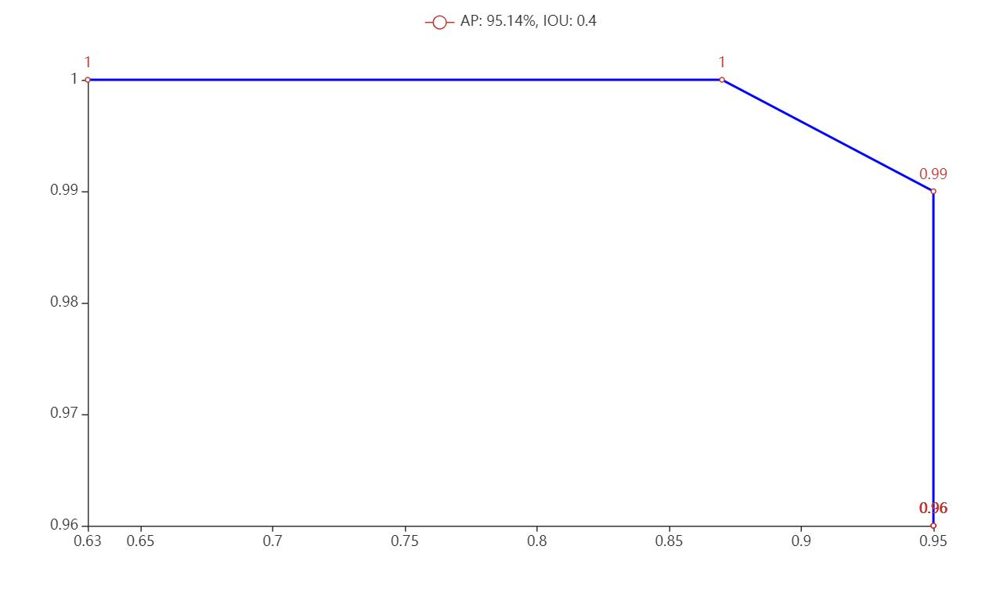

> **pull as sub-module**
---
* git submodule add https://github.com/cheffey/ai_statistic_reporter
* execute examples in mock_detect_execution.py, mock_dicho_execution.py, mock_polyto_execution.py
  
  
  
  
  
  
  
  