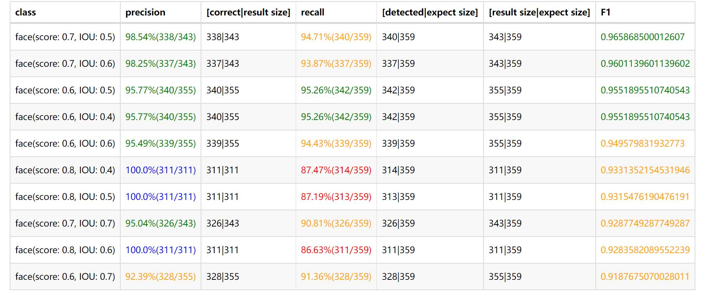

# AI Statistic Reporter (AI统计报告)

Accumulate results of evaluation or test for dichotomous classification, polytomous classification, target detection AI model. And produce statistic table for easier visualization.

##get started
### pull as sub-module as " reporter" folder in project

---
```
git submodule add https://github.com/cheffey/ai_statistic_reporter reporter
```
### execute examples:
#### mock_detect_execution.py(目标检测), mock_dicho_execution.py(二分类), mock_polyto_execution.py(多分类)

  
  
  
  
  
  
  
  

### result cache function examples:
#### cache_result_example.py